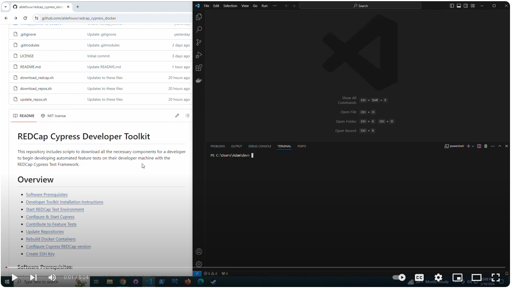
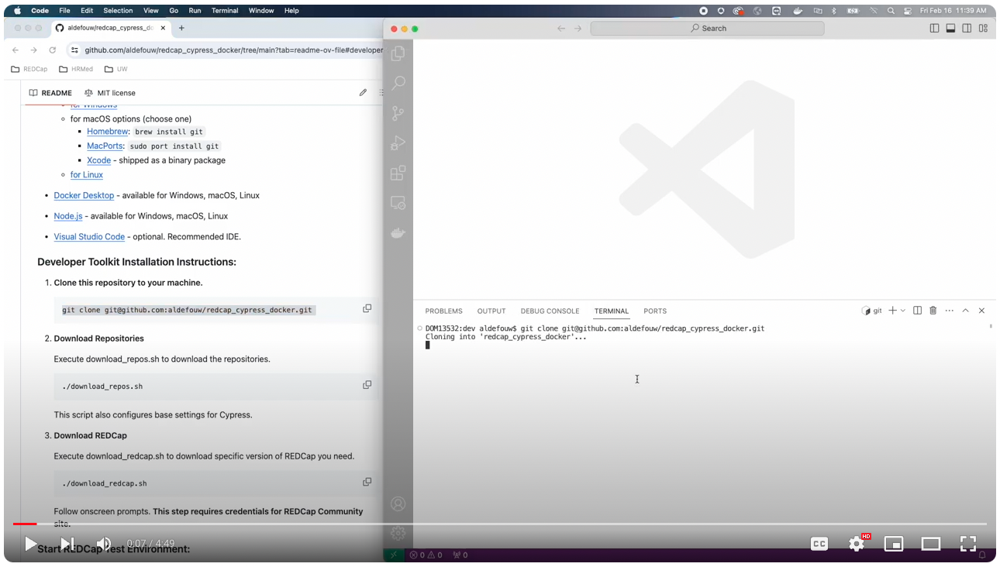

# REDCap Cypress Developer Toolkit

This repository includes scripts to download all the necessary components for a developer to begin developing automated feature tests on their developer machine with the REDCap Cypress Test Framework.

# Windows Tutorial Video
[](https://youtu.be/cQhp9Om8Cgk "Windows Tutorial Video")

# macOS Tutorial Video
[](https://youtu.be/AyR-YFNrlZI "macOS Tutorial Video")

# Overview
- [Software Prerequisites](#software-prerequisites)
- [Developer Toolkit Installation Instructions](#developer-toolkit-installation-instructions)
- [Start REDCap Test Environment](#start-redcap-test-environment)
- [Configure & Start Cypress](#configure--start-cypress)
- [Contribute to Feature Tests](#contribute-to-feature-tests)
- [Update Repositories](#update-repositories)
- [Rebuild Docker Containers](#rebuild-docker-containers)
- [Configure Cypress REDCap version](#configure-cypress-redcap-version)
- [Create SSH Key](#ssh-key)

### Software Prerequisites:

A developer needs the following software on their machine before installing this Developer Toolkit.

- Git (version control)
     - [for Windows](https://gitforwindows.org/)
     - for macOS options (choose one)
         - [Homebrew](https://brew.sh/): `brew install git`
         - [MacPorts](https://www.macports.org/): `sudo port install git` 
         - [Xcode](https://developer.apple.com/xcode/) - shipped as a binary package
     - [for Linux](https://git-scm.com/download/linux)
     

- [Docker Desktop](https://www.docker.com/products/docker-desktop/) - available for Windows, macOS, Linux
- [Node.js](https://nodejs.org/en/download) - available for Windows, macOS, Linux
- [Visual Studio Code](https://code.visualstudio.com/) - optional.  Recommended IDE.

### Developer Toolkit Installation Instructions:

1. **Clone this repository to your machine.**
    
    ```
    git clone git@github.com:aldefouw/redcap_cypress_docker.git
    ```

2. **Download Repositories**

    Execute download_repos.sh to download the repositories.  

    ```
    ./download_repos.sh
    ```
    This script also configures base settings for Cypress.

3. **Download REDCap**

    Execute download_redcap.sh to download specific version of REDCap you need.  
    
    ```
    ./download_redcap.sh
    ```   
    Follow onscreen prompts.  **This step requires credentials for REDCap Community site.**


### Start REDCap Test Environment:

Start your REDCap Docker containers (PHP/Apache, MySQL, Mailhog).  

```
cd redcap_docker
docker compose up
```
    
### Configure & Start Cypress:

1. Install Cypress & dependencies for REDCap Cypress Test Framework.

```
cd redcap_cypress
npm install
```

2. Open Cypress.

```
npx cypress open
```

### Contribute to Feature Tests:

1. Create your own fork of redcap_rsvc that is based upon https://github.com/aldefouw/redcap_rsvc

2. Configure the cloned redcap_rsvc repository as needed to match your own Fork.

```
cd redcap_cypress/redcap_rsvc
git remote rename origin upstream
git remote add origin <your_fork_url_here>
```

Having your own fork enables you to issue pull requests to aldefouw/redcap_rsvc after you complete a feature.

### Update Repositories:

Execute ./update_repos.sh from this repository.  

```
./update_repos.sh
```   

This will resync your Developer Toolkit to the latest versions.  

**Caution:** _Only do this if you understand what the implications of updating submodules are._

## Additional Information

### Rebuild Docker Containers

If changes are made to the Docker images, you will need to rebuild your containers before spooling them up.

```
docker compose build
```

### Configure Cypress REDCap Version

If you want to test against a new version of REDCap that you've downloaded, first [Download REDCap](#developer-toolkit-installation-instructions).

Then change the following variable in `redcap_cypress/cypress.env.json` to the specific version of REDCap you want to test:

```
    "redcap_version": "13.1.37"
```

### Create SSH Key

You will need to place your public key on GitHub for this process to work correctly.

To generate a key on your local machine, most of time the command is:
```
ssh-keygen
```

Generating a key is beyond the scope of what this documentation can cover.

Please consult GitHub's SSH documentation for more information: 
https://docs.github.com/en/authentication/connecting-to-github-with-ssh
